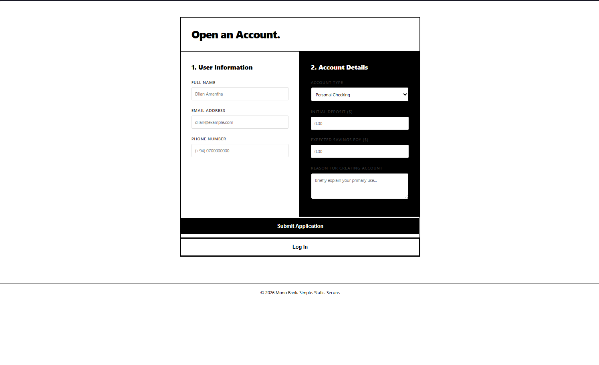
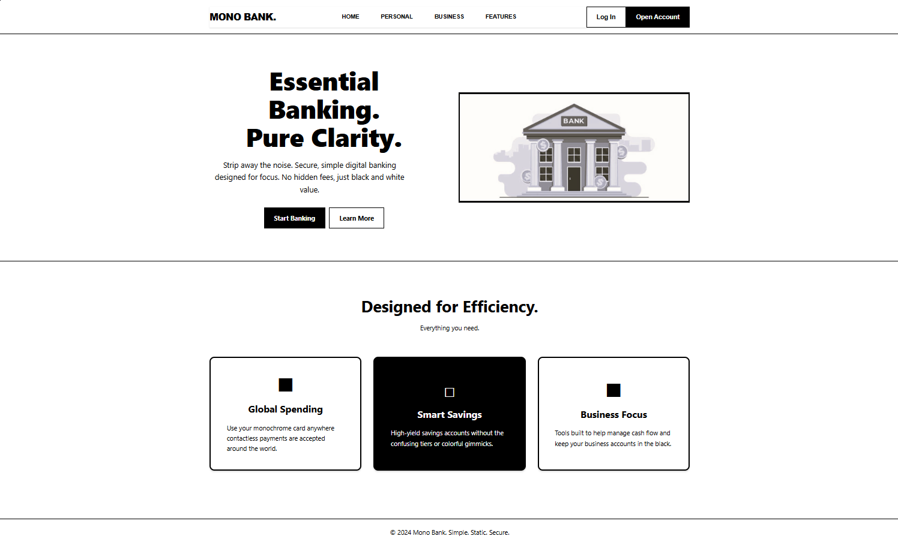

<h1>🏦 Banking Site </h1>

<p> 
A modern, full-stack digital banking platform built with React, Spring Boot, and MySQL. 
Features include secure authentication, a multi-step account creation wizard, and an interactive financial dashboard.
</p>

<div align="center">
<h4>
   <a href="#features">Features</a> •
   <a href="#getting-started">Getting Started</a> •
   <a href="#tech-stack">Tech Stack</a> •
   <a href="#preview">Preview</a> 
</h4>
</div>

## ✨ Features

* MySQL database for storing user credentials
* Spring Boot REST API for handling user authentication
* React front-end login interface

## 🚀 Getting Started

### Installation

```bash
# 1. Clone this repository
git clone https://github.com/lynx7843/Banking-Site.git

# 2. Configure the database in MySQL

# 3. Run the front-end
cd Banking-Site/frontend/src
npm run dev
```

## ⚙️ Tech Stack

* Front-end: React
* Back-end: Spring Boot
* Database: MySQL

## 📷 Preview





