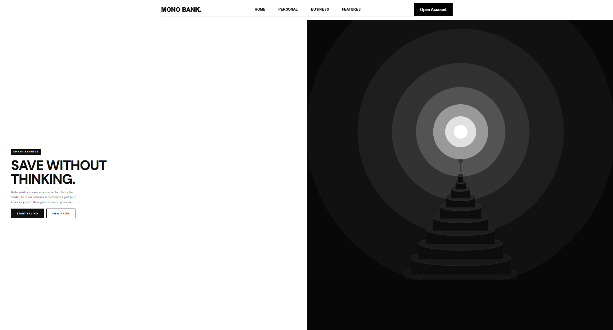
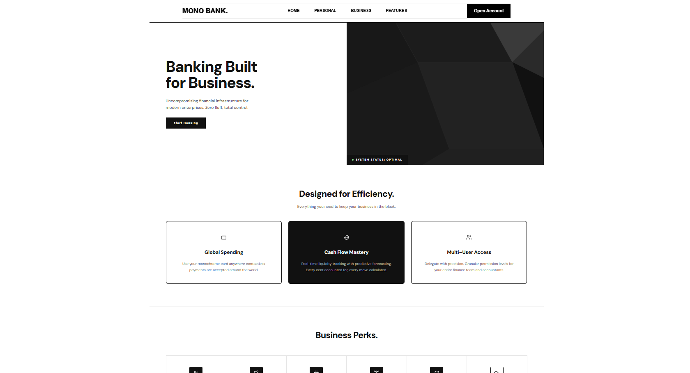
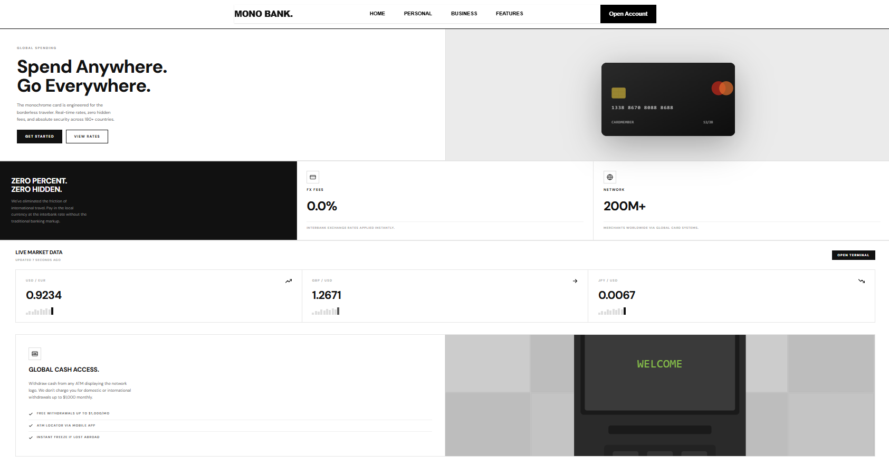

<div align="center">
<h1>🏦 Banking Site </h1>

<p> 
A modern, full-stack digital banking platform built with React, Spring Boot, and MySQL. 
Features include secure authentication, a multi-step account creation wizard, and an interactive financial dashboard.
</p>

<h4>
   <a href="#features">Features</a> •
   <a href="#getting-started">Getting Started</a> •
   <a href="#tech-stack">Tech Stack</a> •
   <a href="#preview">Preview</a> 
</h4>
</div>

<a id="features"></a>
## ✨ Features

* MongoDB atlas for data storage
* Spring Boot REST API for handling user authentication
* React front-end login interface

<a id="getting-started"></a>
## 🛠️ Getting Started

### Installation

```bash
1. Clone this repository
git clone [https://github.com/lynx7843/Banking-Site.git](https://github.com/lynx7843/Banking-Site.git)

2. Configure the MongoDB atlas
Step 1: Create the Cluster (banking_app_db)
Step 2: Get Your Connection String
        Create and Insert the String under spring.mongodb.uri Variable inside application.properties
Step 3: Create Collections
- account_details
- customer_info
- transactions

3. Start the back-end
cd src
mvn spring-boot:run

4. Start the front-end
cd Banking-Site/frontend/src
npm run dev
```

<a id="tech-stack"></a>
## ⚙️ Tech Stack

* Front-end: React
* Back-end: Spring Boot
* Database: MongoDB atlas

<a id="preview"></a>
## 📷 Preview

<div align="center">
  <table>
    <tr>
      <td align="center">
        <h4>Login</h4>
        
      </td>
      <td align="center">
        <h4>SignUp</h4>
        
      </td>
    </tr>
    <tr>
      <td align="center">
        <h4>Dashboard</h4>
        
      </td>
      <td align="center">
        <h4>Personal Account</h4>
        
      </td>
    </tr>
    <tr>
      <td align="center">
        <h4>Business Account</h4>
        
      </td>
      <td align="center">
        <h4>Features</h4>
        
      </td>
    </tr>
  </table>
</div>
